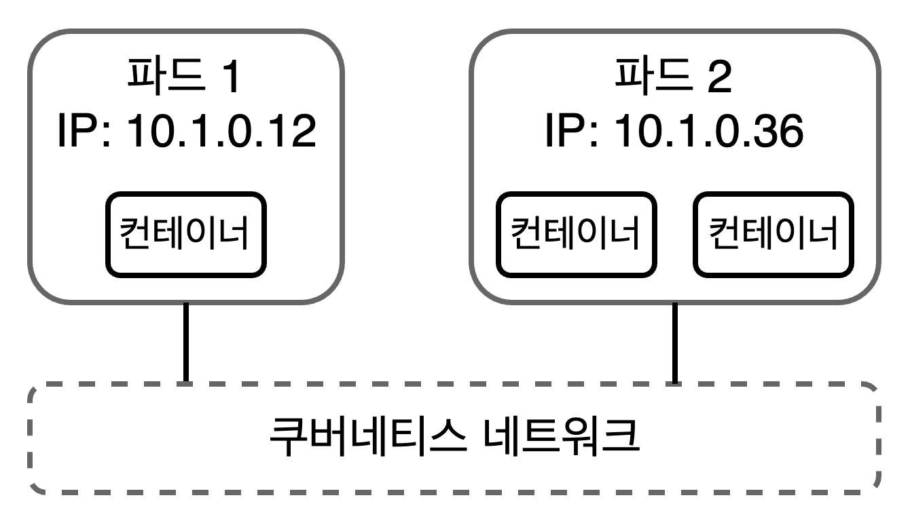

# Chapter 02. 쿠버네티스 이해하기

쿠버네티스는 컨테이너로 어플리케이션을 실행하지만, 우리는 컨테이너를 직접 다루지 않는다.  
컨테이너는 파드에 포함되어 동작하는데, 우리는 파드를 사용해서 컨테이너를 관리한다.

- 2장 명령어 참고: [/gilbutITbook/kiamol/2-14장-명령모음.txt](https://github.com/gilbutITbook/kiamol/blob/main/2-14%EC%9E%A5-%EB%AA%85%EB%A0%B9%EB%AA%A8%EC%9D%8C.txt)

## 2.1 쿠버네티스는 어떻게 컨테이너를 실행하고 관리하는가

### 컨테이너

애플리케이션 구성 요소 하나를 실행하는 가상화된 환경.

- 쿠버네티스는 이 컨테이너를 또 다른 가상환경인 파드로 감싼다.
- 모든 컨테이너는 파드(pod)에 속한다.

### 파드 (pod)

쿠버네티스가 하나 또는 그 이상의 컨테이너를 관리하는데 사용하는 단위를 말한다.

- 컴퓨팅의 단위로, 클러스터(cluster)를 이루는 노드 중 하나에서 실행된다.
- 쿠버네티스로 관리되는 자신만의 가상 IP 주소를 가진다.
  - 이 주소로 가상 네트워크에 접속된 다른 파드, 심지어 다른 노드에서 실행되는 파드라도 통신을 주고받을 수 있다.
- 파드 하나는 컨테이너 하나를 포함하는데, 설정에 따라 파드 하나가 여러 개의 컨테이너를 포함할 수도 있다.
- 파드는 다른 리소스가 관리하고, 이런 고수준 리소스는 컨테이너의 세부 사항을 추상화시킨다.
  - 이 방법으로 자기수복형 애플리케이션이나 ‘바람직한 상태(desired-state)’ 워크플로가 가능해진다.
  - 쿠버네티스에 우리가 원하는 애플리케이션의 상태를 지시하면, 이 상태를 실제로 만들어내는 것이다.

### 네트워크

파드에 포함된 모든 컨테이너는 같은 가상 환경에 포함되며, 네트워크를 공유한다.



- 파드는 쿠버네티스가 관리하는 가상 네트워크에 연결된다.
- 파드는 IP 주소를 기반으로 통신한다.
  - 각각의 파드에는 IP 주소가 부여된다.
  - 파드에 포함된 모든 컨테이너는 이 IP 주소를 공유한다.
  - 파드에 포함된 IP 주소가 여러개이면, 이들은 localhost로 서로 통신할 수 있다.
  - 서로 다른 노드에서 실행되더라도 통신이 가능하다.

### 실습: 파드 실행 및 확인하기

```
# 컨테이너 하나를 담은 파드를 실행한다
# 도커 허브에서 제공하는 `kiamol/ch02-hello-kiamol` 이미지로 실행한 한 개의 컨테이너가 들어 있는 파드를 `hello-kiamol`이라는 이름으로 생성한다.
kubectl run hello-kiamol --image=kiamol/ch02-hello-kiamol

# 결과
pod/hello-kiamol created
```

```
# 파드가 준비 상태가 될 때까지 기다린다
kubectl wait --for=condition=Ready pod hello-kiamol

# 결과
pod/hello-kiamol condition met #파드가 Ready 상태가 됨
```

#### Q. 왜 `kubectl wait --for=condition=Ready`를 따로 수행해야 하는가?

`kubectl run`으로 파드를 생성하면 파드가 생성되었음을 의미하지, 바로 Ready 상태로 전환된다는 보장이 없다.

- 쿠버네티스에서 파드는 여러 단계의 **상태(Phase)**를 거친다.
  - **Pending**: 파드가 생성되어 스케줄링 중이거나 컨테이너 이미지가 내려받는 중인 상태.
  - **Running**: 파드가 노드에 할당되어 컨테이너가 실행중인 상태.
  - **Ready**: 파드의 컨테이너가 모두 정상적으로 실행되고, 네트워크 및 readiness probe가 성공한 상태.
    - **Readiness Probe**
      - 쿠버네티스에서 **파드가 트래픽을 받을 준비가 되었는지 확인**하는 메커니즘.
      - HTTP, TCP, 또는 실행 명령을 통해 애플리케이션의 상태를 주기적으로 체크한다.
      - Probe가 실패하면 파드는 Ready 상태로 간주되지 않아 서비스 트래픽에서 제외된다.
- `kubectl run`은 파드 생성 명령일 뿐, **컨테이너가 준비됐는지까지는 확인하지 않는다.**
  - 이미지 다운로드가 오래걸리거나 컨테이너가 크래시 나면, Pending이나 CrashLoopBackOff 상태로 빠질 수 있다.
  - `kubectl run` 바로 다음에 `kubectl describe`나 `kubectl get pods` 명령을 실행하면 **아직 준비되지 않은 파드 상태를 보게 되는 문제가 발생**한다.
- `kubectl wait --for=condition=Ready`는 파드의 Ready 상태를 기다려 진짜 서비스 가능한 상태인지 확인해주는 안전장치다.
  - 이후에 로그를 보거나, kubectl exec, kubectl port-forward 같은 작업을 해도 실패하지 않게 해준다.

```
# 현재 클러스터에 있는 모든 파드의 목록을 출력한다
kubectl get pods

# 결과
NAME           READY   STATUS    RESTARTS   AGE
hello-kiamol   1/1     Running   0          19m
```

```
# 파드의 상세 정보를 확인한다
# IP 주소와 파드를 실행하는 노드 등 특정 파드에 대한 상세 정보 출력한다
kubectl describe pod hello-kiamol

# 결과
# 위험 정보는 마스킹 처리
Name:             hello-kiamol
Namespace:        default
Priority:         0
Service Account:  default
Node:             docker-desktop/192.168.65.3
Start Time:       Wed, 26 Mar 2025 11:43:14 +0900
Labels:           run=hello-kiamol
Annotations:      <none>
Status:           Running
IP:               10.1.0.43 #쿠버네티스 클러스터 내부 IP. 외부에서 접근 불가.
IPs:
  IP:  10.1.0.43
Containers:
  hello-kiamol:
    Container ID:   docker://fb5ab32c8e404d7077632d32d9090e0e7b962f8967302af1c5785e602e0b5355
    Image:          kiamol/ch02-hello-kiamol
    Image ID:       docker-pullable://kiamol/ch02-hello-kiamol@sha256:f4165d27755978cffde4e5cc7187e8123d929d239409e108e760130d9e0d8f2f
    Port:           <none>
    Host Port:      <none>
    State:          Running
      Started:      Wed, 26 Mar 2025 11:43:19 +0900
    Ready:          True
    Restart Count:  0
    Environment:    <none>
    Mounts:
      /******/serviceaccount from kube-api-access-****** (ro)
Conditions:
  Type                        Status
  PodReadyToStartContainers   True
  Initialized                 True
  Ready                       True
  ContainersReady             True
  PodScheduled                True
Volumes:
  kube-api-access-fqs6g:
    Type:                    Projected (a volume that contains injected data from multiple sources)
    TokenExpirationSeconds:  3607
    ConfigMapName:           kube-root-ca.crt
    ConfigMapOptional:       <nil>
    DownwardAPI:             true
QoS Class:                   BestEffort
Node-Selectors:              <none>
Tolerations:                 node.kubernetes.io/not-ready:NoExecute op=Exists for 300s
                             node.kubernetes.io/unreachable:NoExecute op=Exists for 300s
Events:
  Type    Reason     Age   From               Message
  ----    ------     ----  ----               -------
  Normal  Scheduled  19m   default-scheduler  Successfully assigned default/hello-kiamol to docker-desktop
  Normal  Pulling    19m   kubelet            Pulling image "kiamol/ch02-hello-kiamol"
  Normal  Pulled     19m   kubelet            Successfully pulled image "kiamol/ch02-hello-kiamol" in 5.358s (5.358s including waiting). Image size: 22009873 bytes.
  Normal  Created    19m   kubelet            Created container: hello-kiamol
  Normal  Started    19m   kubelet            Started container hello-kiamol
```

## 2.2 컨트롤러 객체와 함께 파드 실행하기

## 2.3 애플리케이션 매니페스트에 베포 정의하기

## 2.4 파드에서 실행 중인 애플리케이션에 접근하기

## 2.5 쿠버네티스의 리소스 관리 이해하기

## 2.6 연습문제
